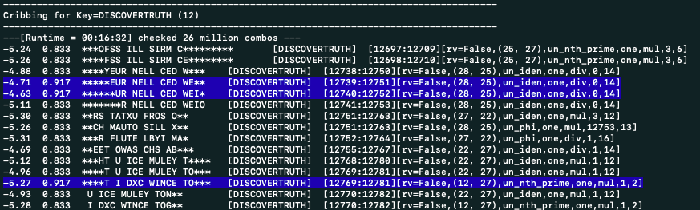

This library is very messy and a WIP. Use at your own risk.

The main file to run is `guess_key.py` and pass it a comma-separated list of guesses for keys

```shell
python scripts/guess_key.py 'CIRCUMFERENCE,PROGRAMYOURMIND,INTERCONNECTEDNESS'
```


This will apply several functions to the Unsolved LP and then score the output and show the best matches to real text.

This assumes the cipher is of the form:
```
C[i] = F(PT[i] - offset_pt) * G(K[i] - offset_k) * H(i - i_offset) * CONSTANT
```




The format of the output reads:

```shell
-5.28  0.846  *****N TOH TOC OW NIT M**** 	[ENLIGHTENMENT]	 [12949:12962][rv=False,(22, 27),un_nth_prime,one,div,0,9]
```

- `-5.28`: 4-gram rune score, higher is better, always negative, ignores spaces. real sentences will get around a -4
- `0.846`: cribbing score. uses spaces to figure out how many letters would need to be changed to make real words
- `*****N TOH TOC OW NIT M****`: The section of the LP that the key is being applied to
- `[ENLIGHTENMENT]`: They key used
- `[12949:12962]`: The indexes of the runes in the LP
- `[rv=False,(22, 27),un_nth_prime,one,div,0,9]`: function params
  - `rv`: wether to apply the key forwards or backwards
  - `(22, 27)`: plaintext gematria offset, key gematria offset
  - `un_nth_prime`: function applied to key `F`
  - `one`: function applied to key `G`
  - `div`: function applied to F*G, H (only mul or div makes sense right now)
  - `0`: The `i_offset` applied to `i` in `H()`
  - `9`: The constant `CONSTANT`
